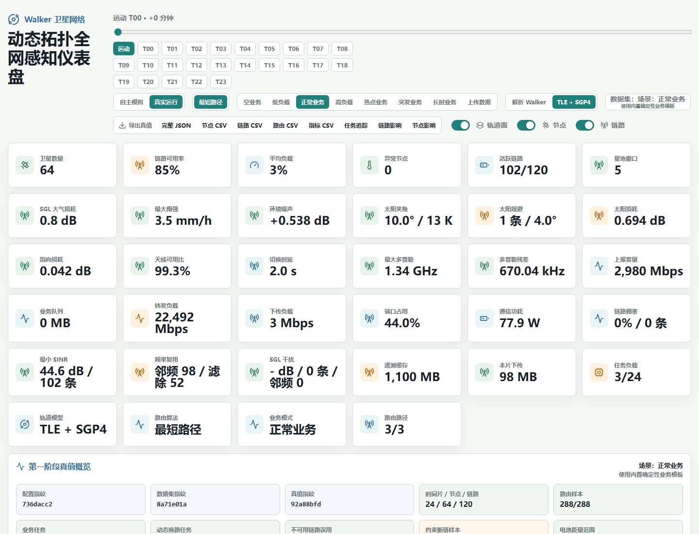
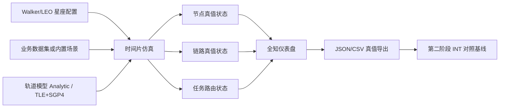
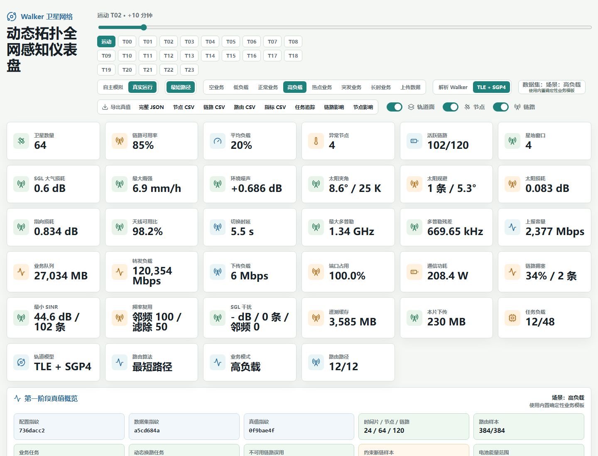
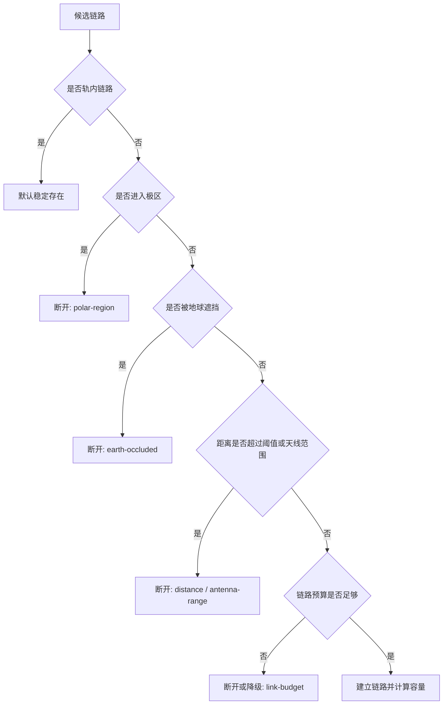
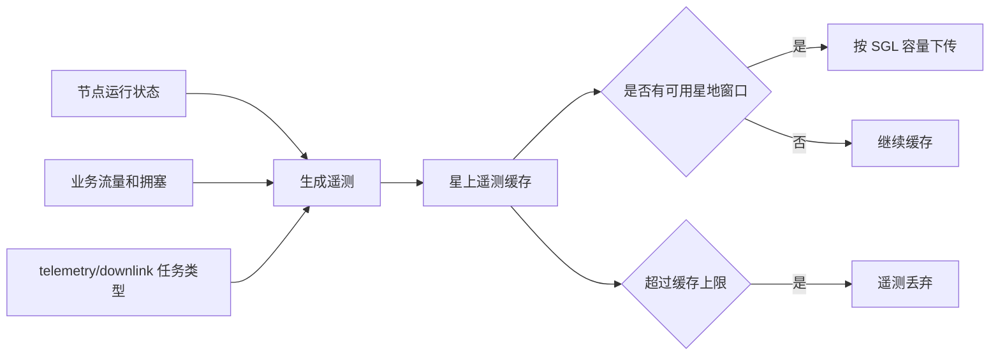
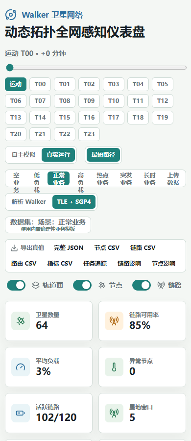
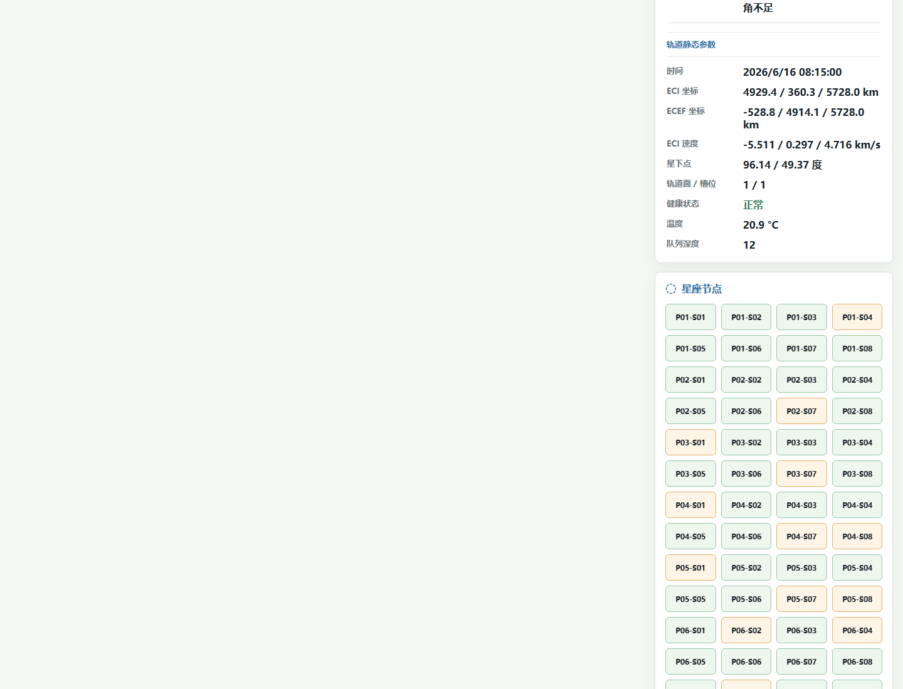

# INT-Temerity 第一阶段完工总结与用户使用指南

本文档面向本项目当前的第一阶段目标：先把 Walker/LEO 卫星网络本体仿真正常，再在第二阶段引入 INT 遥测机制。第一阶段允许仪表盘直接读取全网真值状态，核心问题是：

给定一个 Walker/LEO 星座和业务流量输入，系统能否产生合理、稳定、可解释的卫星网络反应。

当前结论：第一阶段已经形成可运行、可复现、可导出的网络级仿真真值层。最新自动验证结果为 `100/100`，`reports/stage1/stage1-freeze-manifest.json` 中 `overall_ready` 为 `true`。它可以作为第二阶段 INT 设计时的真值底座，但仍应注意当前使用的是 synthetic-walker TLE 风格数据，后续接入 CelesTrak 或 Space-Track 真实公开 TLE 后还需要重新校准。



## 一、最近三小时修改总结

### 1. 第一阶段目标边界进一步明确

当前阶段不实现 INT 报文采集、INT 插入、INT 解析或 INT 观测误差评估。它只负责产生全知真值：

- 每个时间片的卫星节点轨道、位置、速度、资源、电量、温度、缓存和遥测状态。
- 每个时间片的星间链路、星地链路、链路预算、容量、拥塞、队列和断链原因。
- 每个时间片的业务任务、最短路径路由、承载流量、排队量、丢弃量和节点影响。

这样第二阶段可以把 INT 观测结果和第一阶段真值层进行对照，而不是让 INT 机制替代网络本体建模。

### 2. 业务数据集输入标准化

已强化外部业务数据输入的解析和校验：

- 标准字段包括 `time`、`source`、`target`、`traffic_mbps`、`compute_units`、`memory_gb`、`storage_gb`、`duration_slices`、`priority`、`task_type`。
- 支持 CSV 和 JSON 两种上传形式。
- 支持字段别名归一化，例如 `src` -> `source`，`dst` -> `target`，`cpu` -> `compute_units`，`traffic` -> `traffic_mbps`。
- 非法数值不再静默变成 0，而是进入 `normalization_errors` 并被验证器拒绝。
- `task_type` 被限制为固定语义集合：`compute`、`routing`、`downlink`、`telemetry`、`mixed`、`background`、`burst`。
- 路由任务要求 `source` 和 `target` 必须不同，避免自路由任务污染业务实验。

相关文件：

- `schemas/task-dataset.schema.json`
- `schemas/task-dataset-file.schema.json`
- `src/simulation/traffic.ts`
- `examples/datasets/stage1-standard-traffic.csv`
- `examples/datasets/stage1-standard-traffic.json`

### 3. 场景模板完善

系统现在内置并自动验证以下业务场景：

| 场景 | 含义 | 主要用途 |
| --- | --- | --- |
| `empty` | 空业务 | 验证资源空闲、链路无业务利用率、电量仍按光照变化 |
| `low-load` | 低负载 | 验证路由可达且不过载 |
| `normal` | 正常业务 | 默认演示场景，观察普通业务下状态变化 |
| `high-load` | 高负载 | 验证 CPU、功耗、链路拥塞、队列和丢弃响应 |
| `hotspot` | 局部热点 | 验证局部节点和链路压力集中 |
| `burst` | 突发业务 | 验证短时间队列、拥塞和丢弃 |
| `long-duration` | 长时间持续业务 | 验证拓扑变化下路径动态重选 |
| `uploaded` | 上传数据 | 验证外部业务数据集驱动仿真 |

最近修复了 `hotspot` 场景中曾出现的 `source === target` 自路由任务，当前模板已通过 round-trip 校验。

### 4. 真实运行模式去演示波动化

演示模式可以保留确定性波动，用于展示节点自主状态变化。真实运行模式必须由业务、拓扑、队列、链路预算和能耗公式驱动。

为此，自动审计新增了一个对照实验：

1. 运行正常高负载真实运行模式。
2. 将演示波动参数 `nodeThermalWaveC`、`nodeLoadWavePercent`、`queueWaveDepth`、`linkUtilizationWavePercent` 放大 50 倍。
3. 再运行同一高负载真实运行模式。
4. 对比完整真值指纹。

最新结果：

- `operationalIgnoresDemoWaves: true`
- `demoWaveStressTruthFingerprintStable: true`
- 审计项数量从 29 增加到 30。

这说明真实运行模式没有被演示波动参数污染。

### 5. 自动化验收体系增强

当前 `npm run verify:stage1` 会依次运行：

| 步骤 | 作用 |
| --- | --- |
| `build` | TypeScript 和 Vite 构建 |
| `templates` | 导出并校验场景模板 |
| `dashboard` | 审计仪表盘控件、指纹、3D/2D 拓扑、响应式布局 |
| `dataset` | 校验标准 CSV 数据集 |
| `dataset-json` | 校验标准 JSON 数据集 |
| `assessment` | 生成第一阶段成熟度评估 |
| `business-trace` | 导出业务到节点/链路影响追踪 |
| `freeze-manifest` | 生成第一阶段冻结清单 |
| `exports` | 检查真值导出表结构 |

最新结果：

| 指标 | 当前值 |
| --- | --- |
| 阶段一评分 | `100/100` |
| 配置指纹 | `736dacc2` |
| 标准上传数据集指纹 | `a714455c` |
| 标准上传真值指纹 | `725fee70` |
| 验收检查项 | `30` |
| 冻结清单 | `overall_ready: true` |

## 二、系统整体仿真能力

### 1. 第一阶段已经实现的核心能力



已经覆盖：

- Walker-Star 星座拓扑，当前默认 8 个轨道面，每面 8 颗卫星，共 64 颗卫星。
- 24 个时间片，每片 5 分钟，仿真窗口 120 分钟。
- Analytic Walker 和 TLE + SGP4 两种轨道模式。
- 极区断链、距离阈值、地球遮挡、链路预算不足等拓扑约束。
- 星间链路 ISL 和星地链路 SGL 建模。
- 天线方向、最大波束数、切换可用比例、频段、带宽和增益。
- FSPL、接收功率、噪声功率、SNR/SINR、容量、MCS/PER 粗粒度估计。
- 同频和邻频干扰聚合。
- 多普勒频移、补偿残差、太阳规避角和太阳损耗。
- 星地可见窗口、仰角、雨衰、天气时间线、遥测缓存和下传。
- 最短路径路由、优先级调度、链路拥塞、队列、丢弃。
- 节点 CPU/GPU、内存、存储、电池、太阳光照、温度、通信功耗和网络计算功耗。
- 业务任务对节点和链路状态的可追踪因果影响。

### 2. 当前仍保留的边界

当前模型是网络级高仿真原型，不是完整通信物理层仿真器。以下部分刻意简化或暂缓：

- 真实公开 TLE 数据源尚未接入，目前是 synthetic-walker TLE 风格数据。
- 没有完整 MAC 层退避、逐包重传和 FEC 编译码过程。
- 没有真实硬件级射频链路链路级仿真。
- 没有热控结构、电池老化、太阳翼姿态伺服细节。
- 没有 INT 遥测报文采集、封装、解析和观测误差评估。

这些边界是合理的，因为当前阶段的目标是建立“可信真值底座”。

## 三、快速开始

### 1. 安装依赖

```bash
npm install
```

### 2. 打开网页端

```bash
npm run dev
```

终端会输出类似：

```text
Local: http://127.0.0.1:5173/
```

如果端口被占用，Vite 会自动换到下一个端口，例如 `5174`。用浏览器打开终端显示的地址即可。

### 3. 运行完整第一阶段验证

```bash
npm run verify:stage1
```

通过时应看到：

```json
{
  "overall_passed": true,
  "assessment_summary": {
    "readiness": "第一阶段可用，可作为第二阶段 INT 设计的真值底座",
    "score": 100,
    "max_score": 100
  }
}
```

### 4. 校验外部业务数据集

```bash
npm run validate:dataset -- --tasks examples/datasets/stage1-standard-traffic.csv
npm run validate:dataset -- --tasks examples/datasets/stage1-standard-traffic.json
```

`Errors` 必须为 `0`。如果有 error，不建议把该数据集用于实验。

## 四、仪表盘界面说明



### 1. 顶部时间控制

顶部时间条用于选择当前展示模式和时间片：

| 控件 | 含义 |
| --- | --- |
| `运动` | 不锁定单一时间片，展示卫星随时间运动的连续状态 |
| `T00` 到 `T23` | 锁定某个时间片，所有节点、链路、路由和表格同步显示该时间片快照 |
| 时间滑条 | 与时间片按钮配合，用于观察拓扑随时间演化 |

物理意义：

- 每个时间片长度为 5 分钟。
- 24 个时间片覆盖 120 分钟。
- 选择时间片时，3D 拓扑、2D 拓扑、节点状态、链路状态和任务路由表都会同步到同一快照。

### 2. 运行模式

| 模式 | 含义 | 适用场景 |
| --- | --- | --- |
| `自主模拟` | 使用确定性波动展示节点自主状态 | 演示状态变化，不作为严肃业务实验 |
| `真实运行` | 由业务、链路、队列、能耗公式驱动状态 | 第一阶段实验和第二阶段 INT 真值对照 |

真实运行模式下：

- 空业务时 CPU/GPU/队列/转发负载应接近 0。
- 有业务时，状态由任务负载、路径、链路容量、队列、缓存和能耗公式推导。
- 相同配置和相同业务输入应得到完全一致的真值指纹。
- 演示波动参数不会影响真实运行结果。

### 3. 路由算法

当前支持：

| 算法 | 含义 |
| --- | --- |
| `最短路径` | 在当前时间片可用链路图上搜索跳数/距离意义下的最短路径 |

后续可以在此位置加入更高级算法，例如拥塞感知路由、能量感知路由、地面站优先路由或多路径路由。

### 4. 业务模式

| 按钮 | 含义 |
| --- | --- |
| `空业务` | 不注入任何业务任务 |
| `低负载` | 少量跨星流量，验证基本可达 |
| `正常业务` | 默认场景，适合日常观察 |
| `高负载` | 提高流量和计算负载，压测链路和节点 |
| `热点业务` | 业务集中到部分节点附近，观察局部拥塞 |
| `突发业务` | 短时间高流量，观察瞬时队列和丢弃 |
| `长时业务` | 跨越大部分时间片，观察动态换路 |
| `上传数据` | 使用用户上传 CSV 或 JSON 数据集 |

### 5. 轨道模型

| 模型 | 含义 |
| --- | --- |
| `解析 Walker` | 按 Walker 星座几何和圆轨道近似计算 |
| `TLE + SGP4` | 使用 TLE 推出的轨道要素并通过 SGP4 传播位置 |

当前 `TLE + SGP4` 已经接入传播链路，但 TLE 来源是 synthetic-walker 风格数据。它保留每颗卫星的 NORAD ID、名称、COSPAR ID、轨道面、槽位、TLE line 1/2、epoch、倾角、RAAN、偏心率、近地点幅角、平近点角、平均运动、BSTAR 等字段。后续替换为 CelesTrak 或 Space-Track 公开 TLE 后，可以继续沿用这一数据结构。

### 6. 拓扑显示开关

| 开关 | 含义 |
| --- | --- |
| `轨道面` | 显示或隐藏轨道面圆环，帮助观察 Walker 平面分布 |
| `节点` | 显示或隐藏卫星节点 |
| `链路` | 显示或隐藏星间链路 |

链路显示会跟随当前时间片的真实链路状态：

- 断开的链路不会在拓扑中继续显示为可用连接。
- 极区、距离阈值、地球遮挡、链路预算不足、天线范围等限制都会影响链路是否显示为可用。

### 7. 真值导出按钮

仪表盘顶部提供：

| 导出项 | 内容 |
| --- | --- |
| `完整 JSON` | metadata、全部时间片、节点、链路、路由和指标 |
| `节点 CSV` | 每个时间片每颗卫星的轨道、资源、电量、任务和遥测状态 |
| `链路 CSV` | 每个时间片每条链路的状态、预算、容量、拥塞和断链原因 |
| `路由 CSV` | 每个时间片每条任务路由的路径、跳数、承载、排队和丢弃 |
| `指标 CSV` | 每个时间片的全网汇总指标 |
| `任务追踪` | 任务到路径、链路、节点状态的因果追踪 |
| `链路影响` | 每条任务对经过链路的影响 |
| `节点影响` | 每条任务对源/中继/目的/本地节点的影响 |

这些导出文件是第二阶段 INT 对照实验的重要真值来源。

## 五、核心指标卡片说明

仪表盘上方的指标卡片给出当前时间片或当前场景的网络状态摘要。

| 指标 | 物理或网络意义 |
| --- | --- |
| `卫星数量` | 当前星座节点数量，默认 64 |
| `链路可用率` | 可用链路数 / 候选链路数 |
| `平均负载` | 全网平均 CPU 利用率 |
| `异常节点` | warning 或 degraded 节点数量 |
| `活跃链路` | 当前可用链路数和总候选链路数 |
| `星地窗口` | 当前可用 SGL 可见窗口数量 |
| `SGL 大气损耗` | 星地链路因雨衰、气体、云等引入的损耗 |
| `最大雨强` | 地面站天气时间线中的当前最大雨强 |
| `环境噪声` | 太阳噪声和背景噪声对链路的影响 |
| `太阳夹角` | 链路方向与太阳方向的夹角 |
| `太阳规避` | 因太阳规避角限制受影响的链路数量 |
| `太阳损耗` | 太阳干扰造成的附加损耗 |
| `指向损耗` | 天线转向、抖动、跟踪滞后引起的损耗 |
| `天线可用比` | 天线在切换和跟踪后可用于通信的比例 |
| `切换时延` | 天线重新指向或链路切换所需时间 |
| `最大多普勒` | 相对运动造成的最大频移 |
| `多普勒残差` | 补偿后剩余频偏 |
| `上报容量` | 星地链路可用于遥测回传的容量 |
| `业务队列` | 业务流量未被链路承载而进入队列的数量 |
| `转发负载` | 卫星中继转发承载的流量 |
| `下传负载` | 遥测或业务向地面站回传的负载 |
| `端口占用` | 节点星间链路天线占用情况 |
| `通信功耗` | 链路激活、转发和队列导致的通信功耗 |
| `链路拥塞` | 最大链路拥塞比例和拥塞链路数量 |
| `最小 SINR` | 当前链路预算中最差的信干噪比 |
| `频率复用` | 同频和邻频复用状态 |
| `SGL 干扰` | 星地链路干扰概览 |
| `遥测缓存` | 全网遥测缓存占用 |
| `本片下传` | 当前时间片成功下传遥测量 |
| `任务负载` | 当前业务任务数量 |
| `轨道模型` | 当前使用 Analytic Walker 或 TLE + SGP4 |
| `路由算法` | 当前使用的路由算法 |
| `业务模式` | 当前选择的业务场景 |
| `路由路径` | 当前路由成功样本数量 |

## 六、拓扑视图说明

### 1. 3D 拓扑视图

3D 拓扑以地球为中心，卫星围绕地球运动：

- 地球位于中心。
- 卫星均匀部署在多个轨道面上。
- 轨道面按 180 度范围平分，符合 Walker-Star 极轨星座的平面分布习惯。
- 轨内链路长期稳定。
- 轨间链路受距离、极区、地球遮挡、天线范围和链路预算影响。
- 进入极区时，卫星不会建立左右两侧轨间链路。

### 2. 2D 时间片拓扑

2D 拓扑用于快速观察某个时间片下的链路快照：

- 每个轨道面是一列或一组节点。
- 同轨道面节点按槽位排列。
- 轨内链路和轨间链路使用不同视觉关系展示。
- 选择 `T00` 到 `T23` 时，2D 拓扑会同步显示该时间片真实连接状态。

### 3. 点击节点或链路

点击节点后，右侧或下方的节点状态面板会展示：

- 节点编号、节点类型、所属轨道面、槽位。
- 当前经纬度、高度、速度、东西向地面漂移。
- CPU/GPU、内存、存储、电量、光照、功耗、温度。
- 入站、出站、中继、下传流量。
- 遥测生成、缓存、下传和丢弃。
- 最佳地面站窗口。
- 可展开的轨道静态参数。

点击链路后，链路状态面板会展示：

- 链路类型：轨内、轨间或星地。
- 链路状态：up、warning、down。
- 断链原因：极区、距离阈值、地球遮挡、天线范围、链路预算不足、太阳规避等。
- 距离、时延、带宽、容量、需求、承载、排队、丢弃。
- FSPL、接收功率、噪声功率、SNR/SINR、MCS 和 PER。

## 七、节点状态参数物理意义

| 字段 | 含义 | 当前建模方式 |
| --- | --- | --- |
| `cpu_utilization` | 总 CPU 利用率 | 计算任务、端点业务流量、转发流量、队列维护共同贡献 |
| `compute_cpu_percent` | 计算任务 CPU | `compute_units / cpu_capacity * 100` |
| `task_traffic_cpu_percent` | 端点收发业务 CPU | `(ingress + egress) / 1000 * endpointCpuPercentPerGbps` |
| `forwarding_cpu_percent` | 中继转发 CPU | `carriedIslTrafficMbps / 1000 * forwardingCpuPercentPerGbps` |
| `queue_cpu_percent` | 队列维护 CPU | `queuedTrafficGb * queueCpuPercentPerGb` |
| `gpu_utilization` | GPU 利用率 | 本地或业务任务的 GPU 需求映射 |
| `memory_used_gb` | 内存占用 | 任务内存 + 队列内存 + 遥测缓存内存 |
| `storage_used_gb` | 存储占用 | 任务存储 + 缓存占用 |
| `energy_wh` | 电池剩余能量 | 光照发电和负载功耗逐时间片积分 |
| `state_of_charge` | 荷电状态 SoC | `energy_wh / batteryCapacityWh` |
| `solar_power_w` | 太阳翼发电功率 | 太阳常数、太阳翼面积、效率、光照系数 |
| `load_power_w` | 总负载功率 | 基础、通信、计算、载荷、队列等功耗之和 |
| `net_power_w` | 净功率 | 充电功率减放电功率 |
| `power_saving_mode` | 节能模式 | SoC 低于最小阈值时启用 |
| `temperatureC` | 温度 | 基础温度 + CPU/GPU/通信功耗热增量 |
| `queued_traffic_mb` | 节点队列 | 链路承载不足后的业务缓存 |
| `cache_used_mb` | 缓存占用 | 业务队列 + 遥测缓存 |
| `telemetry_generated_mb` | 遥测生成量 | 基础遥测 + CPU + 流量 + 拥塞 + 任务类型采样 |
| `telemetry_buffer_mb` | 遥测缓存 | 未下传遥测保留在星上 |
| `telemetry_downlinked_mb` | 遥测下传 | 当前时间片通过 SGL 下传到地面站 |

核心公式摘要：

```text
CPU = compute_cpu_percent
    + task_traffic_cpu_percent
    + forwarding_cpu_percent
    + queue_cpu_percent

Memory = workload_memory_gb
       + queued_traffic_mb / 1024 * queueMemoryGbPerQueuedGb
       + telemetry_buffer_mb / 1024 * telemetryMemoryGbPerBufferedGb

Storage = workload_storage_gb
        + cache_used_mb / 1024 * cacheStorageGbPerBufferedGb

Energy(t + dt) = clip[
  Energy(t)
  + chargeEfficiency * max(Pgen - Pload, 0) * dt
  - max(Pload - Pgen, 0) / dischargeEfficiency * dt
]

Temperature = baseTemperature
            + cpu_utilization * thermalRisePerCpuPercent
            + gpu_utilization * thermalRisePerGpuPercent
            + communication_power_w * thermalRisePerCommunicationW
```

## 八、链路状态参数物理意义

| 字段 | 含义 |
| --- | --- |
| `status` | 链路状态，up、warning 或 down |
| `restrictionReason` | 断链或降级原因 |
| `distanceKm` | 两端节点距离 |
| `latencyMs` | 传播时延和模型附加时延 |
| `bandwidthMbps` | 当前链路标称带宽 |
| `capacityMbps` | 链路预算和 MCS 后得到的有效容量 |
| `demandTrafficMbps` | 当前业务对该链路的需求 |
| `carriedTrafficMbps` | 链路实际承载流量 |
| `queuedTrafficMb` | 链路未承载进入队列的流量 |
| `droppedTrafficMb` | 队列容量不足后丢弃的流量 |
| `utilizationPercent` | `carriedTrafficMbps / capacityMbps` |
| `congestionPercent` | 需求超过容量的比例 |
| `fspl_db` | 自由空间路径损耗 |
| `rx_power_dbm` | 接收功率 |
| `noise_power_dbm` | 噪声功率 |
| `snr_db` | 信噪比 |
| `sinr_db` | 信干噪比 |
| `mcs_id` | 当前选择的粗粒度调制编码方案 |
| `packet_error_rate` | 估计误包率 |

链路能否建立，主要受以下因素影响：



## 九、星地窗口和遥测回传

星地链路 SGL 用于遥测和数据回传。系统会为每个时间片计算：

- 卫星与地面站之间的可见性。
- 仰角是否高于地面站门限。
- 距离是否在 SGL 天线最大范围内。
- 天气和雨衰造成的附加损耗。
- 天线占用和可用比例。
- 当前可用于遥测回传的容量。

遥测缓存逻辑：



这对第二阶段 INT 很重要，因为 INT 采集到的状态最终也需要回传地面。第一阶段现在已经为“遥测生成、缓存、下传、丢弃”提供了真值字段。

## 十、业务数据集格式

### 1. CSV 标准表头

```csv
task_id,time,start_slice,duration_slices,source,target,node_id,compute_units,gpu_units,memory_gb,storage_gb,traffic_mbps,priority,task_type
```

### 2. 路由任务示例

```csv
FLOW-001,T00,0,6,P01-S01,P05-S05,,40,0,1.5,2,300,2,mixed
```

含义：

- 从 `P01-S01` 到 `P05-S05` 建立跨星路由任务。
- 从 `T00` 开始，持续 6 个时间片。
- 注入 300 Mbps 业务流量。
- 同时给源节点施加一定计算、内存和存储需求。
- 优先级为 2。

### 3. 本地计算任务示例

```csv
LOCAL-001,T04,4,4,,,P03-S02,120,8,4,12,0,1,compute
```

含义：

- 不经过星间路由。
- 直接把计算、GPU、内存和存储任务投放到 `P03-S02`。
- `traffic_mbps` 为 0。

### 4. JSON 文件示例

```json
{
  "dataset_id": "example-stage1",
  "tasks": [
    {
      "task_id": "FLOW-001",
      "time": "T00",
      "start_slice": 0,
      "duration_slices": 6,
      "source": "P01-S01",
      "target": "P05-S05",
      "compute_units": 40,
      "gpu_units": 0,
      "memory_gb": 1.5,
      "storage_gb": 2,
      "traffic_mbps": 300,
      "priority": 2,
      "task_type": "mixed"
    }
  ]
}
```

### 5. 数据集规则

- 路由任务必须填写 `source` 和 `target`，且不能填写 `node_id`。
- 本地任务必须填写 `node_id`，且不能填写 `source` 或 `target`。
- `traffic_mbps > 0` 的任务必须是合法路由任务。
- `source` 和 `target` 不能相同。
- 数值字段必须是合法有限数字，不能写成 `abc`、空字符串或无限值。
- `task_type` 必须属于固定集合。
- 空业务建议直接使用内置 `empty` 场景，不建议上传全 0 数据集伪造空业务。

## 十一、主要配置参数及物理意义

### 1. 星座和时间

| 参数 | 当前值 | 含义 |
| --- | --- | --- |
| `walkerType` | `star` | Walker-Star 星座 |
| `planes` | 8 | 轨道面数量 |
| `satellitesPerPlane` | 8 | 每个轨道面卫星数量 |
| `phasing` | 1 | 相邻轨道面相位偏移 |
| `altitudeKm` | 1200 km | 默认轨道高度 |
| `inclinationDeg` | 86.4 deg | 轨道倾角，接近极轨 |
| `slices` | 24 | 时间片数量 |
| `stepMinutes` | 5 min | 每片时长 |

### 2. 拓扑约束

| 参数 | 当前值 | 含义 |
| --- | --- | --- |
| `interPlane.maxDistanceKm` | 3600 km | 轨间链路最大距离阈值 |
| `warningMarginKm` | 450 km | 接近阈值时进入 warning |
| `maxLinksPerNode` | 4 | 每颗卫星最多 4 条 ISL，前、后、左、右 |
| `polarRegion.latitudeDeg` | 66.5 deg | 极区限制纬度 |
| `earthOcclusion.clearanceKm` | 25 km | 地球遮挡安全余量 |

### 3. 节点资源

| 参数 | 当前值 | 含义 |
| --- | --- | --- |
| `cpu_capacity` | 256 | 抽象 CPU 容量 |
| `gpu_capacity` | 32 | 抽象 GPU 容量 |
| `memory` | 128 GB | 星上内存 |
| `storage` | 4096 GB | 星上存储 |
| `cacheCapacityMb` | 8192 MB | 业务和遥测缓存上限 |
| `telemetryBufferCapacityMb` | 2048 MB | 遥测缓存上限 |

### 4. 电源和热模型

| 参数 | 当前值 | 含义 |
| --- | --- | --- |
| `solarConstantWPerM2` | 1361 W/m² | 太阳常数 |
| `solarArrayAreaM2` | 2.0 m² | 太阳翼面积 |
| `solarArrayEfficiency` | 0.28 | 太阳翼效率 |
| `batteryCapacityWh` | 1200 Wh | 电池容量 |
| `minStateOfCharge` | 0.2 | 节能模式门限 |
| `basePowerW` | 80 W | 平台基础功耗 |
| `communicationPowerW` | 100 W | 通信基础功耗 |
| `computePowerW` | 50 W | 计算功耗标定 |
| `payloadPowerW` | 100 W | 载荷功耗 |
| `chargeEfficiency` | 0.95 | 充电效率 |
| `dischargeEfficiency` | 0.95 | 放电效率 |

太阳翼峰值发电约为：

```text
Psa,max = 1361 * 2.0 * 0.28 ≈ 762 W
```

平均基础负载约为：

```text
Pload = 80 + 100 + 50 + 100 = 330 W
```

### 5. 业务和队列

| 参数 | 当前值 | 含义 |
| --- | --- | --- |
| `normalFlowCount` | 24 | 正常业务默认任务数 |
| `normalFlowMinMbps` | 130 Mbps | 正常业务最小流量 |
| `normalFlowMaxMbps` | 560 Mbps | 正常业务最大流量 |
| `endpointCpuPercentPerGbps` | 15 | 源/目的端每 Gbps 流量 CPU 开销 |
| `forwardingCpuPercentPerGbps` | 6 | 中继转发每 Gbps CPU 开销 |
| `forwardingPowerWPerGbps` | 28 W | 中继转发每 Gbps 功耗 |
| `linkQueueCapacityMb` | 16384 MB | 链路队列上限 |
| `queueCarryoverRatio` | 0.65 | 队列跨片保留比例 |

### 6. 天线和链路预算

| 项目 | ISL 星间链路 | SGL 星地链路 |
| --- | --- | --- |
| 频段 | laser | Ka |
| 增益 | 105 dBi | 34 dBi |
| 波束宽度 | 1.2 deg | 8 deg |
| 最大距离 | 6500 km | 4200 km |
| 最大发射功率 | 40 W | 30 W |
| 带宽 | 2500 Mbps | 1200 Mbps |
| 最小仰角 | 不适用 | 25 deg |
| 上报容量 | 不适用 | 600 Mbps |

链路预算中使用：

- 自由空间路径损耗 FSPL。
- 发射功率和天线增益。
- 大气损耗、极化损耗、指向损耗。
- 噪声系数、带宽和噪声温度。
- 同频和邻频干扰。
- SINR 到 MCS 和容量的粗粒度映射。

## 十二、报告和验收文件

| 文件 | 含义 |
| --- | --- |
| `reports/stage1/stage1-acceptance.json` | 7 项验收和 30 个检查项的完整结果 |
| `reports/stage1/stage1-model-assessment.json` | 第一阶段成熟度评分 |
| `reports/stage1/stage1-parameter-baseline.json` | 参数基线和物理公式摘要 |
| `reports/stage1/stage1-scenario-matrix.json` | 场景矩阵对比 |
| `reports/stage1/stage1-business-trace.json` | 标准业务追踪总览 |
| `reports/stage1/stage1-business-task-trace.csv` | 任务级追踪 |
| `reports/stage1/stage1-business-link-impact.csv` | 链路影响追踪 |
| `reports/stage1/stage1-business-node-impact.csv` | 节点影响追踪 |
| `reports/stage1/stage1-freeze-manifest.json` | 第一阶段冻结清单 |
| `reports/stage1/stage1-dashboard-audit.json` | 仪表盘审计 |
| `reports/stage1/stage1-verification.json` | 完整 verify 汇总 |

推荐实验前后都运行：

```bash
npm run verify:stage1
```

如果要单独刷新第一阶段验收报告：

```bash
npm run report:stage1
```

如果要单独导出参数基线：

```bash
npm run baseline:stage1
```

如果要单独导出业务追踪：

```bash
npm run trace:stage1
```

## 十三、推荐使用流程

### 1. 用内置场景观察模型

1. 打开仪表盘。
2. 选择 `真实运行`。
3. 选择 `TLE + SGP4`。
4. 依次查看 `空业务`、`低负载`、`正常业务`、`高负载`、`热点业务`、`突发业务`、`长时业务`。
5. 在 `T00` 到 `T23` 之间切换，观察链路断开、路由换路、队列和电量变化。

### 2. 上传自己的业务数据集

1. 按 `schemas/task-dataset.schema.json` 准备 CSV 或 JSON。
2. 先运行：

```bash
npm run validate:dataset -- --tasks path/to/tasks.csv
```

3. 确认 `Errors: 0`。
4. 在仪表盘点击 `上传数据`。
5. 观察任务路由、链路拥塞、节点 CPU、遥测缓存和电量变化。
6. 导出 JSON/CSV 真值。

### 3. 做第一阶段实验留档

每次实验建议记录：

- `config_fingerprint`
- `dataset_fingerprint`
- `truth_fingerprint`
- 使用的业务数据集文件
- 使用的轨道模型
- 使用的路由算法
- `stage1-freeze-manifest.json`

这样第二阶段做 INT 遥测时，可以明确 INT 观测结果对应哪一次第一阶段真值。

## 十四、移动端和表格视图

仪表盘支持移动端查看，但建议复杂分析在桌面端完成。



中下部表格区域用于细查链路、路由和星地窗口：



表格区主要包括：

- `全部链路`：查看每条链路的状态、类型、利用率和断链原因。
- `任务路由`：查看当前时间片每条业务任务的路径、承载、排队、丢弃和遥测增量。
- `星地窗口`：查看卫星与地面站之间的可见窗口、仰角、容量和天气影响。
- `星座节点`：快速选择节点并查看详细状态。

## 十五、当前第一阶段完工判断

按最初的阶段一目标评估，当前项目已经从“展示模型”进入“可验证的网络级仿真真值层”：

| 维度 | 当前状态 |
| --- | --- |
| Walker/LEO 拓扑动态 | 较好，支持 Walker 几何和 TLE+SGP4 传播 |
| 链路连接/断开机制 | 较好，覆盖极区、距离、遮挡、预算、天线约束 |
| 链路预算与容量变化 | 中高，覆盖 FSPL、功率、增益、噪声、SINR、容量、MCS |
| 业务流量影响链路和节点状态 | 中高，支持路由、拥塞、队列、丢弃、节点负载联动 |
| 节点资源/能量状态建模 | 中高，CPU、内存、存储、电池、温度、功耗已公式化 |
| 仪表盘全知展示 | 较好，支持时间片、3D/2D、节点、链路、任务、导出 |
| 业务数据集驱动仿真 | 较好，支持标准 schema、模板、上传、校验和因果追踪 |
| 自动化验收 | 较好，30 项检查、100/100 评分、冻结清单 |

因此，第一阶段当前可以作为第二阶段 INT 设计的真值底座。进入第二阶段前，建议只做两类收尾：

- 接入真实公开 TLE 数据源并重新校准参数。
- 固化论文或实验采用的业务流量矩阵，避免用演示业务替代研究业务。

除此之外，不建议现在急着把系统做成完整通信链路级仿真器。当前复杂度已经足够支撑网络级 INT 遥测复现实验的第一阶段底座。
